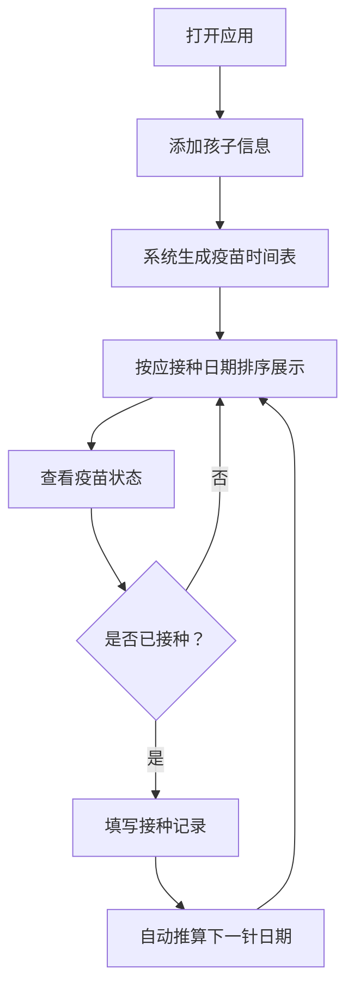

## 1. 产品概述

儿童健康记录工具，帮助家长管理孩子的疫苗接种记录，自动追踪国家免疫规划疫苗接种时间表，提醒下一针接种日期。
- 主要用途：记录儿童疫苗接种信息，自动推算下一针接种时间，避免漏种
- 目标用户：有孩子的家长或监护人

## 2. 核心功能

### 2.1 用户角色
| 角色 | 注册方式 | 核心权限 |
|------|----------|----------|
| 家长用户 | 无需注册，本地使用 | 添加孩子信息、管理疫苗接种记录、查看接种时间表 |

### 2.2 功能模块
1. **孩子信息管理**：添加/编辑/删除孩子信息（姓名、出生日期、性别）
2. **疫苗时间表展示**：按"下一个应接种日期"排序展示国家免疫规划疫苗
3. **接种记录管理**：标记已接种、记录接种日期、接种机构、疫苗批号
4. **自动推算**：已接种疫苗后自动推算下一针接种日期

### 2.3 页面详情
| 页面名称 | 模块名称 | 功能描述 |
|-----------|-------------|---------------------|
| 首页（仪表盘） | 孩子列表卡片 | 展示已添加的所有孩子，点击切换查看 |
| 首页（仪表盘） | 添加孩子按钮 | 弹出表单添加新孩子信息 |
| 疫苗时间表 | 疫苗列表 | 按应接种日期排序展示所有疫苗，区分已接种/待接种/已逾期 |
| 疫苗时间表 | 接种记录弹窗 | 填写接种日期、接种机构、疫苗批号，标记已接种 |
| 疫苗时间表 | 状态指示器 | 用颜色区分疫苗状态（已接种绿色、待接种蓝色、已逾期红色） |

## 3. 核心流程

用户打开应用后，首先添加孩子信息，系统根据孩子出生日期自动生成国家免疫规划疫苗接种时间表，按应接种日期排序展示。用户可随时标记疫苗已接种并填写详细信息，系统自动推算并更新后续疫苗的应接种日期。

## 4. 用户界面设计

### 4.1 设计风格
- 主色调：温暖柔和的天蓝色 (#4A90D9)，搭配清新的薄荷绿 (#5CB85C) 和珊瑚红 (#D9534F)
- 辅助色：浅灰背景，白色卡片
- 按钮风格：圆角胶囊按钮，柔和阴影
- 字体：使用 "Noto Sans SC" 作为中文显示字体，"Poppins" 作为数字和英文辅助字体
- 布局风格：卡片式布局，顶部导航，左侧孩子列表，右侧疫苗时间表
- 图标风格：圆润可爱的线性图标，使用 emoji 增强亲和力

### 4.2 页面设计概述
| 页面名称 | 模块名称 | UI元素 |
|-----------|-------------|-------------|
| 首页（仪表盘） | 孩子列表卡片 | 头像占位符、姓名、年龄、性别图标、卡片悬停效果 |
| 首页（仪表盘） | 添加孩子按钮 | 浮动操作按钮，带加号图标，悬停动画 |
| 疫苗时间表 | 疫苗列表 | 时间轴式布局，状态色条，接种信息卡片 |
| 疫苗时间表 | 状态指示器 | 状态标签（已接种/待接种/已逾期）带对应颜色 |
| 疫苗时间表 | 接种记录弹窗 | 模态框，表单输入，日期选择器 |

### 4.3 响应式
- 采用桌面端优先设计，同时适配移动端
- 桌面端：左右分栏布局，左侧孩子列表（30%宽度），右侧疫苗时间表（70%宽度）
- 移动端：上下堆叠布局，孩子列表折叠为可展开的选择器
- 触控优化：按钮最小高度 44px，充足点击区域
