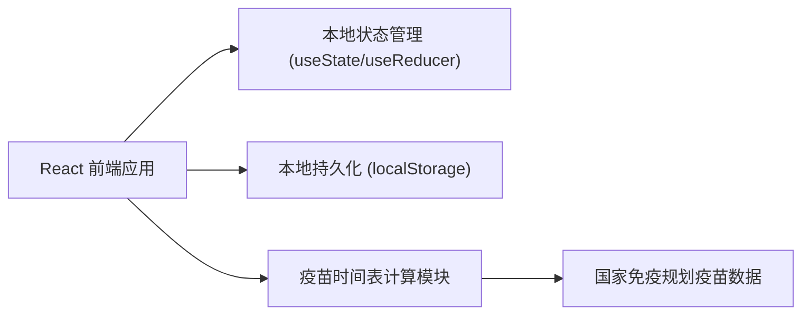
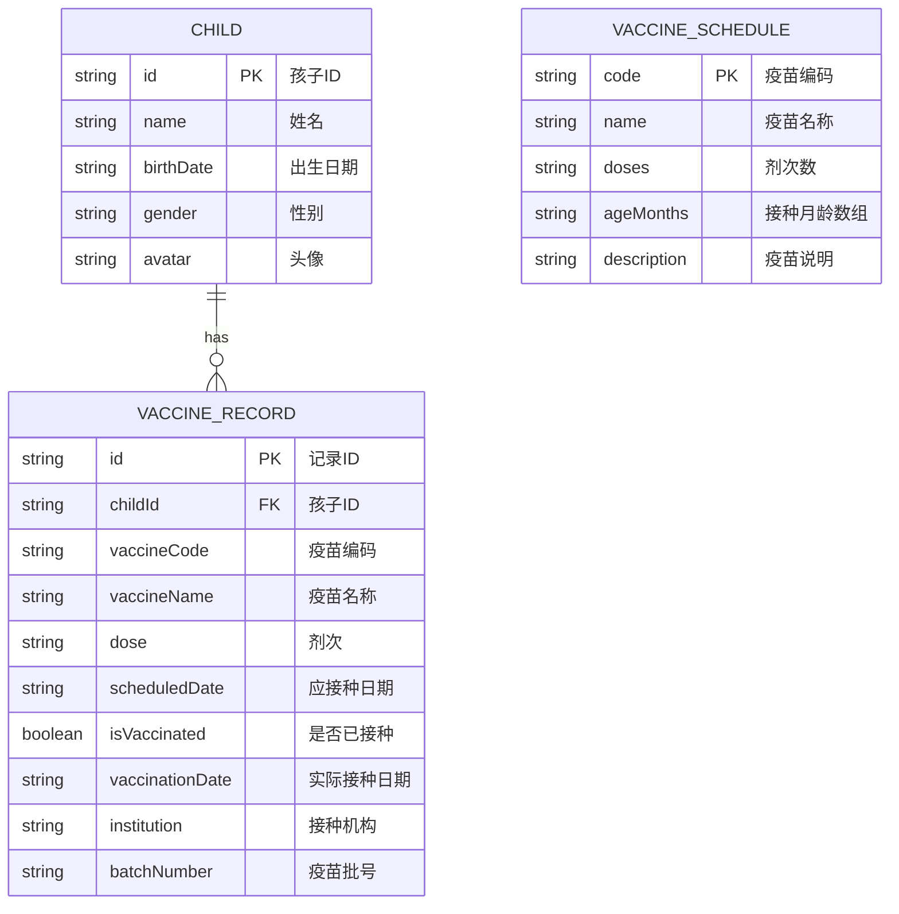

## 1. 架构设计



## 2. 技术描述
- 前端：React@18 + TypeScript + tailwindcss@3 + vite
- 初始化工具：vite-init
- 后端：无（纯前端应用，数据本地存储）
- 数据库：localStorage 本地存储
- 状态管理：React hooks (useState, useEffect, useMemo)
- 日期处理：原生 Date API + 自定义工具函数

## 3. 路由定义
| Route | Purpose |
|-------|---------|
| / | 主页面，包含孩子管理和疫苗时间表 |

## 4. 数据模型

### 4.1 数据模型定义



### 4.2 数据结构定义

```typescript
interface Child {
  id: string;
  name: string;
  birthDate: string;
  gender: 'male' | 'female';
  avatar?: string;
}

interface VaccineRecord {
  id: string;
  childId: string;
  vaccineCode: string;
  vaccineName: string;
  dose: number;
  scheduledDate: string;
  isVaccinated: boolean;
  vaccinationDate?: string;
  institution?: string;
  batchNumber?: string;
}

interface VaccineSchedule {
  code: string;
  name: string;
  doses: number;
  ageMonths: number[];
  description: string;
}
```

### 4.3 国家免疫规划疫苗预置数据

```typescript
const VACCINE_SCHEDULES: VaccineSchedule[] = [
  { code: 'BCG', name: '卡介苗', doses: 1, ageMonths: [0], description: '预防结核病' },
  { code: 'HepB', name: '乙肝疫苗', doses: 3, ageMonths: [0, 1, 6], description: '预防乙型肝炎' },
  { code: 'OPV', name: '脊灰疫苗', doses: 4, ageMonths: [2, 3, 4, 48], description: '预防脊髓灰质炎' },
  { code: 'DTaP', name: '百白破疫苗', doses: 4, ageMonths: [3, 4, 5, 18], description: '预防百日咳、白喉、破伤风' },
  { code: 'MPR', name: '麻腮风疫苗', doses: 2, ageMonths: [8, 18], description: '预防麻疹、腮腺炎、风疹' },
  { code: 'JE', name: '乙脑疫苗', doses: 2, ageMonths: [8, 24], description: '预防流行性乙型脑炎' },
  { code: 'MenA', name: 'A群流脑疫苗', doses: 2, ageMonths: [6, 9], description: '预防A群流行性脑脊髓膜炎' },
  { code: 'MenAC', name: 'A+C群流脑疫苗', doses: 2, ageMonths: [36, 72], description: '预防A+C群流行性脑脊髓膜炎' },
  { code: 'HepA', name: '甲肝疫苗', doses: 2, ageMonths: [18, 24], description: '预防甲型肝炎' },
];
```
